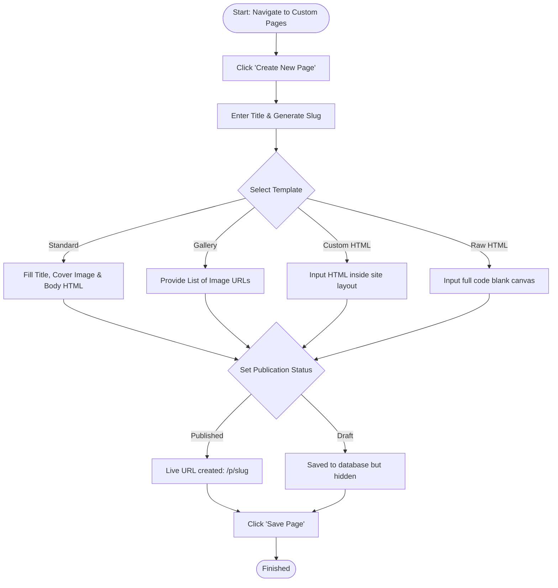
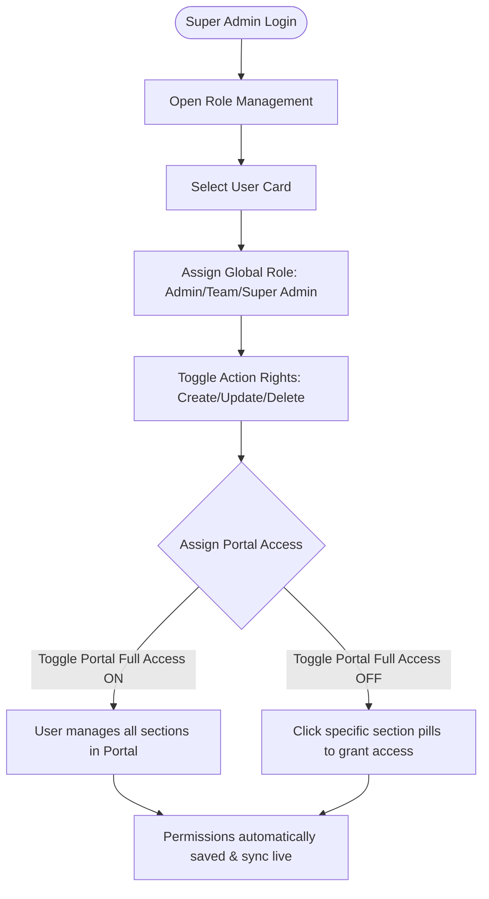
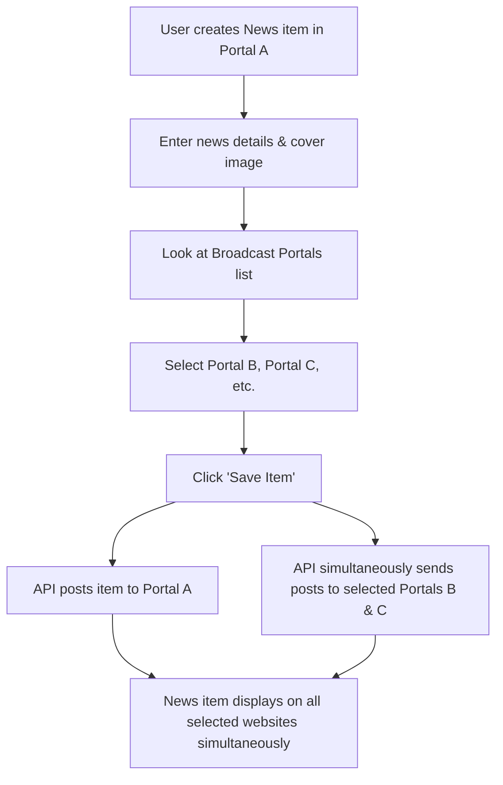

# Ishan Admin Panel: Comprehensive User & Administrator Manual

Welcome to the **Ishan Admin Panel** user guide. This document serves as the official manual for managing content, visibility, custom pages, access control, and consolidated lead acquisition across the Ishan Group of Portals. 

The Ishan Admin Panel is a configuration-driven content management system (CMS) that allows administrators to update multiple institutional portals dynamically, manage prospect enquiries, and assign granular security roles without touching code.

---

## 📖 Table of Contents
1. [System Architecture & Portals Overview](#1-system-architecture--portals-overview)
2. [Interface Navigation & Sidebar Control](#2-interface-navigation--sidebar-control)
3. [Dynamic Content Editing (Generic Editor)](#3-dynamic-content-editing-generic-editor)
   - [Singleton vs. Collection Editor Modes](#singleton-vs-collection-editor-modes)
   - [Field-Level Content Types](#field-level-content-types)
   - [Special Content Operations (Toggling, Duplicating, Broadcasting)](#special-content-operations-toggling-duplicating-broadcasting)
4. [Consolidated Lead Management](#4-consolidated-lead-management)
5. [Role Management & User Permissions](#5-role-management--user-permissions)
6. [Dynamic & Custom Pages Manager](#6-dynamic--custom-pages-manager)
7. [System Workflows](#7-system-workflows)
8. [Troubleshooting & Best Practices](#8-troubleshooting--best-practices)

---

## 1. System Architecture & Portals Overview

The Ishan Admin Panel manages a network of 7 websites using a unified API backend. Content changes published in this dashboard update the live websites instantly.

### Managed Portals & Site Keys
| Site Key | Portal Name | Primary Focus |
| :--- | :--- | :--- |
| `landing1` | **Ishan Group Main Landing** | Group-level home page, common facilities, and general news. |
| `landing2` | **Admissions Landing Page** | Optimized landing pages for admissions campaigns and lead capture. |
| `iimt` | **IIMT Portal** | Ishan Institute of Management & Technology (BBA, BCA, B.Com, etc.). |
| `ayurveda` | **Ishan Ayurvedic College** | BAMS programme, herbal garden registry, academic calendar, and faculty. |
| `hospital` | **Teaching Hospital** | OPD departments, Panchkarma treatments, bed availability, and hospital specs. |
| `legal` | **Ishan Legal Portal** | Law school admissions, legal courses, academic resources, and milestones. |
| `pharmacy` | **Ishan Pharmacy College** | Pharmacy school course directory, laboratories, and placements. |

---

## 2. Interface Navigation & Sidebar Control

The Admin Panel is divided into a **Sidebar Navigation Menu** (left side) and the **Content Management Workspace** (right side).

```
+-------------------------------------------------------------+
|  ISHAN ADMIN   |                                            |
|  Control Center|  Workspace Header (Title, Actions, Save)   |
+----------------+--------------------------------------------+
|  - Dashboard   |                                            |
|  - Leads       |                                            |
|  - Roles       |                                            |
|                |  Content Editor Area                       |
|  MAIN PORTALS  |                                            |
|  - Landing 1   |  - Input Fields                            |
|  - Landing 2   |  - Rich Text Editors                       |
|                |  - Image / File Uploads                    |
|  INSTITUTIONS  |                                            |
|  - IIMT        |                                            |
|  - Ayurveda    |                                            |
|  - Hospital    |                                   a         |
+-------------------------------------------------------------+
```

### Navigating to a Section:
1. **Select Portal**: Click on any of the main portals or institutional sites in the sidebar to expand its pages.
2. **Select Page**: Click a page name (e.g., `About Us`, `Admissions`, `Academics`).
3. **Select Section**: Click on the specific section inside that page (e.g., `Infrastructure`, `Milestones`, `Contact Details`). 
4. The Workspace will load the **Generic Editor** mapped to that section.

---

## 3. Dynamic Content Editing (Generic Editor)

The Generic Editor dynamically generates input fields based on the structure of the section you choose.

### Singleton vs. Collection Editor Modes

Every section operates in one of two modes:

#### 1. Singleton Mode (Single Record)
Used for sections that have a fixed, single layout (e.g., About Us Intro, Contact Info, Site Header/Footer Settings).
* **Editing**: Modify the fields inline.
* **Saving**: You must click the **Save** button in the top-right header to push changes to the server.
* **Indicator**: Displays a "Save" icon in the workspace header.

#### 2. Collection Mode (Multiple Cards/Records)
Used for lists of items that can be added, updated, reordered, or deleted (e.g., News posts, Events, Faculty Members, Gallery photos, Testimonials).
* **Adding**: Click **Add Item** in the top-right header. A clean form drawer will open. Fill out the fields and click **Save Item**.
* **Editing**: Click the **Edit (Pencil)** icon on the card you wish to modify. Adjust values inside the drawer and click **Update Item**.
* **Deleting**: Click the **Delete (Trash)** icon on the card. A confirmation popup will ask for approval before deleting it permanently.

---

### Field-Level Content Types

Depending on the configuration, you will interact with the following input types:

#### 📝 Text (Single-line)
* Used for titles, subtitles, experience numbers, links, or specific metadata.
* Simply click the text area and type. 

#### 📰 Textarea (Rich Text Editor - Jodit)
* Used for page descriptions, rules, syllabus overviews, and policy texts.
* Implements a rich WYSIWYG editor supporting bolding, headers (`H2`, `H3`), lists, text alignment, and raw HTML modifications.
* **Best Practice**: Use standard subheaders and avoid pasting bloated rich-text formats directly from Word. Paste as plain text first if formatting issues occur.

#### 🖼️ Image Upload
* Uses integrated Cloudinary storage.
* **To Upload**: Drag-and-drop or click **Upload Image**. The system uploads it and fills in the image URL automatically.
* **To Reuse**: You can also paste an external image web address (URL) directly into the text input.
* **Preview**: An image preview block appears beside the field when an image is successfully loaded.

#### 📄 File Upload (PDFs/Documents)
* Used for syllabus documents, exam papers, fee structure documents, and mandatory disclosures.
* Click **Upload File** to upload PDF or DOCX files.
* Clicking **View File** will open the currently uploaded file in a new browser tab for validation.

#### 📅 Date Selector
* Used for news dates, events calendar, and press coverage entries.
* Clicking opens the browser's native date picker to format dates accurately (`YYYY-MM-DD`).

#### 🗂️ Array (Repeatable Sub-lists)
* Used for lists inside a single section (e.g., "Core Values" list, "Steps in Admission Process", "Plant Close-ups").
* Click **Add Entry** to create a new sub-item.
* Modify the items inside their respective blocks.
* Click the sub-trash icon to delete a single entry from the list.

#### 📦 Object (Grouped Fields)
* Groups related fields together (e.g., "Main Contact Info" grouping Address, Email, Phone, and Map URL).
* Rendered inside a light gray container separating it from global settings.

---

### Special Content Operations

> [!TIP]
> The top-right corner of the editor window contains advanced operations to duplicate, hide, or broadcast your pages.

#### 👁️ Visibility Toggling (Hide/Unhide)
You can hide sections temporarily from the public-facing portals without deleting the data.
1. Locate the **Hide/Unhide** button in the workspace header.
2. Click **Hide** to make the section invisible on the live portal.
3. Click **Unhide** to restore visibility.
4. *Visual indicator*: Hidden sections display a gray `Hidden` badge next to the section title.

#### 👯 Page/Section Duplication
You can copy an existing section layout and content to form the basis of a new page.
1. Click the **Duplicate** button in the header.
2. Enter the **New Page Name** (e.g., `Independence Day Meet`).
3. Enter the **New URL Slug** (e.g., `independence-day-meet-2026`).
4. Click **Duplicate** to generate the new custom cloned page under the portal.

#### 📣 Cross-Portal News Broadcasting
When publishing news or announcements on one portal, you can broadcast them to other sites in the Ishan network.
1. Expand the news section and click **Add Item**.
2. Fill out the news headline, category, cover image, and body.
3. Locate the **Broadcast to other portals?** section at the bottom of the form.
4. Toggle on the target institutions (e.g., select *Ayurveda*, *Pharmacy*, and *IIMT*).
5. Click **Save Item**. The announcement will instantly publish to all selected portals.

---

## 4. Consolidated Lead Management

The **Consolidated Leads** section aggregates all contact forms and course enquiries filled out across the entire portal ecosystem.

> [!NOTE]
> This section is crucial for admissions counselors, offering a centralized place to monitor inquiries.

### Lead Management Features:
* **Real-time Synchronization**: Click the **Refresh (Sync)** circle icon to fetch the latest inquiries from the database.
* **Universal Search**: Use the search bar to locate prospects instantly by typing their **Name** or **Email Address**.
* **Institutional Filters**: Filter leads by their origin portal (e.g., show only enquiries coming from the *Ishan Ayurvedic Hospital* or the *IIMT Portal*).
* **Lead Export**: Click the **Export All** button to compile and download all lead data for use in CRM software or spreadsheets.
* **Lead Card Breakdown**: Each lead displays:
  - **Portal Source**: The site where they submitted the form.
  - **Prospect Details**: Name, Email, and Phone Number.
  - **Interest/Course**: The specific programme they enquired about.
  - **Received Date**: Date of submission.

---

## 5. Role Management & User Permissions

> [!WARNING]
> Access to Role Management is reserved exclusively for the **Super Admin** account. 

Role Management allows you to provision access, enforce editing rights, and control who can modify content on a site-by-site and section-by-section basis.

### Role Hierarchy
1. **Super Admin**: Full unrestricted system access. Can modify roles, delete users, and access settings across all portals.
2. **Admin**: Can create, update, and delete content for authorized portals, but cannot manage users or change system settings.
3. **Team Member**: Limited user. Typically assigned read-only rights or restricted to updating content in specific sections.

### Action Permissions Toggles
Under each user card, you can toggle basic CRUD permissions:
* **Create**: Allows the user to add items to collections or duplicate pages.
* **Update**: Allows the user to edit text, save singletons, and upload files.
* **Delete**: Allows the user to delete records, files, or custom pages.

### Granular Access Control
You can customize exactly what a user can edit:
* **Full Access (Portal Level)**: Under a portal name (e.g. *IIMT Portal*), toggle **Full Access** on. The user can edit all pages and sections inside that portal.
* **Restricted Access (Section Level)**: Turn **Full Access** off. The system will display all individual sections for that portal. Click specific section pills (e.g., `Syllabus`, `Faculty Directory`, `OPD Departments`) to grant access *only* to those forms. Unselected sections will be locked in read-only mode for that user.

### Deploying a New Operative:
1. Click **Add New User** in the Role Management header.
2. Fill in the **Official Email** and a **Master Password**.
3. Select the role type (**Admin** or **Team Member**).
4. Click **Deploy User**.
5. Once created, modify their access permissions as detailed above.

---

## 6. Dynamic & Custom Pages Manager

Custom Pages Manager gives you the flexibility to deploy non-standard, custom pages (e.g., event registers, feedback pages, regulatory notifications) that are not covered in the default site configuration.

### Custom Page Templates
When creating a page, you can choose from 4 pre-configured layouts:

| Template | What it does | Best Used For |
| :--- | :--- | :--- |
| **Standard Text Page** | Classic article style with a Heading, Cover Image, and a rich text body. | Press releases, updates, event summaries. |
| **Gallery Page** | Auto-generates a grid of photos from a list of URLs. | Campus events, sports meets, convocations. |
| **Custom HTML** | Renders custom HTML/CSS page content *within* the Ishan header navbar and footer layout. | Custom styled campaign landing pages, detailed tables. |
| **Raw HTML** | Renders a completely blank HTML canvas. The header, footer, and theme layouts are omitted. | Bespoke developer layouts, custom web tools. |

### Creating a Custom Page:
1. Navigate to the target Portal, click the **Custom Pages** option in the sidebar.
2. Click **Create New Page**.
3. Input the **Page Title**.
4. **URL Slug**: The system auto-generates the URL slug from the title (e.g. `/p/alumni-meet-2026`). You can modify this slug manually.
5. Select a **Template** type.
6. Toggle **Published** on to make the page active. Keep it toggled off to save as a draft.
7. Fill out the specific content block in the Content Editor section.
8. Click **Save Page** in the header.

---

## 7. System Workflows

The following diagrams illustrate core processes within the admin panel.

### Custom Page Creation Workflow


### User Permission Assignment Workflow


### News Broadcasting Mechanism


---

## 8. Troubleshooting & Best Practices

### ⚠️ Common Errors & Fixes

* **"Failed to upload image / file"**
  * *Reason*: The file is too large or the internet connection dropped.
  * *Solution*: Optimize the image (save as compressed JPG or WebP). Try loading the image again. If it persists, verify the Cloudinary configuration in your environmental variables.

* **"Failed to save page. Please ensure slug is unique."**
  * *Reason*: Another custom page is already using the exact same URL slug.
  * *Solution*: Change the URL slug in the edit drawer (e.g. append the year or a short identifier like `/p/alumni-meet-2026-new`).

* **"Read-Only Mode: Insufficient permissions to modify content."**
  * *Reason*: Your account is assigned to the "Team Member" role without edit permissions for this section.
  * *Solution*: Contact your Super Admin to toggle the "Update" action or assign your account access to this section.

### 💡 Administrator Best Practices

1. **Keep Slugs Clean**: Avoid uppercase letters, spaces, or special characters in URL slugs. Stick to lowercase letters and hyphens (e.g. `bams-syllabus-2026`).
2. **Draft First**: When creating complex custom pages, save them with the **Published** toggle turned OFF. Review the styling in the preview before publishing it.
3. **Use Jodit Code View**: If you need advanced layout modifications in textareas, click the source code icon `</>` in the Jodit toolbar to write clean HTML tags directly.
4. **Regularly Export Leads**: To protect user enquiry databases, export and clear processed leads periodically to maintain CRM cleanliness.
5. **Set Strong Master Passwords**: Ensure all newly deployed administrative roles use unique, alphanumeric passwords.
